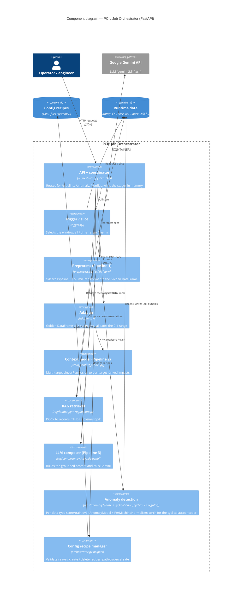
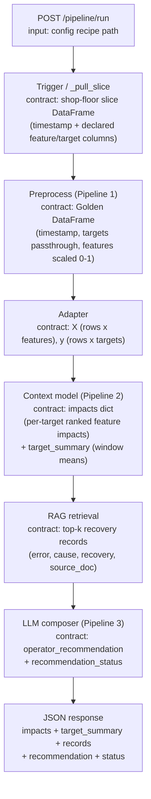
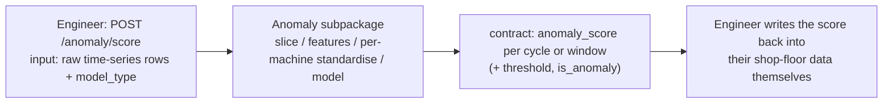

# PCIL Architecture (C4 model)

This document describes the PCIL architecture using the [C4 model](https://c4model.com)
— a set of diagrams at increasing zoom levels:

1. **Context** — the system as one box, its users, and the external systems it talks to.
2. **Container** — the deployable/runnable pieces inside PCIL (apps, services, data stores).
3. **Component** — the major code modules inside one container.
4. *Code* — class/function level. **Skipped** on purpose (the source is the truth at that zoom).

Plus a **runtime data-flow** diagram showing the contract handed between pipeline stages.

> **Scope.** This reflects the **current `main` branch** (commit `49a2696`): a CSV/file
> data source and a **single** orchestrator container (pipeline + anomaly together). The
> PostgreSQL source and the pipeline/anomaly container split are planned on a separate
> branch — see [Roadmap](#roadmap-not-yet-on-main). Levels 1 (Context) and 2 (Container)
> are shown in the [README](README.md#architecture-c4); this document covers Level 3
> (Component) and the data-flow.

All diagrams are Mermaid and render natively on GitHub.

---

## Level 3 — Component (PCIL Job Orchestrator)

Inside the single FastAPI container, the request coordinator (`orchestrator.py`) wires
together the pipeline stages, the anomaly subpackages, and the config-recipe manager.
Data passes between stages **in memory**; nothing is written to disk during a normal run.



Notes:
- The **dashboard** (a separate container, see README) is also served by this process via
  FastAPI `StaticFiles` at `/dashboard`, but it is not a code component of the pipeline.
- The optional Flask `rag_frontend/` demo UI is **not** part of the deployed image and is
  omitted here.

---

## Runtime data-flow — the stage contracts

The diagnosis path (`POST /pipeline/run`). Each arrow is the contract the previous stage
produces and the next one accepts — "stage 1 produces this, stage 2 consumes it":



`target_summary` (from the context-model stage) is also fed into the composer, so the
recommendation is grounded in measured performance, and it drives the dashboard KPI cards.

### Anomaly scoring (separate engineer-facing API)

Anomaly detection is **input to output only** — PCIL never writes to the shop-floor data.
The engineer calls the API and writes the returned score back themselves (only they know
the row mapping):



### Contract table

| Stage | Input | Output contract |
|---|---|---|
| Trigger (`_pull_slice`) | config recipe (trigger mode + source) | shop-floor slice DataFrame (timestamp + declared columns) |
| Preprocess (Pipeline 1) | slice + recipe schema | Golden DataFrame: timestamp, targets (passthrough), features scaled 0-1 |
| Adapter | Golden DataFrame | `X` (rows x features), `y` (rows x targets), names; raises if features leave 0-1 |
| Context model (Pipeline 2) | `X`, `y` | impacts dict (`system`, `context_window`, per-target `ranked_feature_impacts`) + fitted model; orchestrator also computes `target_summary` |
| RAG retrieval | query from target names + top feature descriptions | top-k records (`error`, `cause`, `recovery`, `source_doc`) |
| LLM composer (Pipeline 3) | impacts + records + `target_summary` | `operator_recommendation` + `recommendation_status` (ok / no_records / retrieval_failed / llm_unavailable / rag_unavailable) |
| Response | all of the above | JSON: impacts, target_summary, recovery_records, operator_recommendation, recommendation_status, artifacts |
| `/anomaly/score` | raw time-series rows + `model_type` (+ `model_id`) | `anomaly_score` per cycle/window (+ `threshold`, `is_anomaly`) |
| `/anomaly/train` | uploaded CSV(s) + params | persisted `.pkl` bundle under `data/` |

---

## Roadmap (not yet on `main`)

These change the diagrams above and are deliberately excluded so this doc matches what
ships on `main` today. They are being built on a separate branch:

- **PostgreSQL source (P1).** The Context view gains an external **Shop-floor PostgreSQL
  database**; the orchestrator's `_pull_slice` gains a SQL branch (query built from the
  recipe; `psycopg` + SQLAlchemy via a `PCIL_DB_URL` env var). The CSV path stays as a
  fallback.
- **Pipeline / anomaly container split (P2).** The single orchestrator container becomes
  **two** containers — a lightweight **Pipeline service** and an **Anomaly service** (with
  `torch` only in the anomaly image) — so projects that do not need anomaly detection can
  run the pipeline alone.

When that branch merges, add a second Container diagram here showing both services + the
database, and keep this one as the "single-container" baseline for comparison.
```
