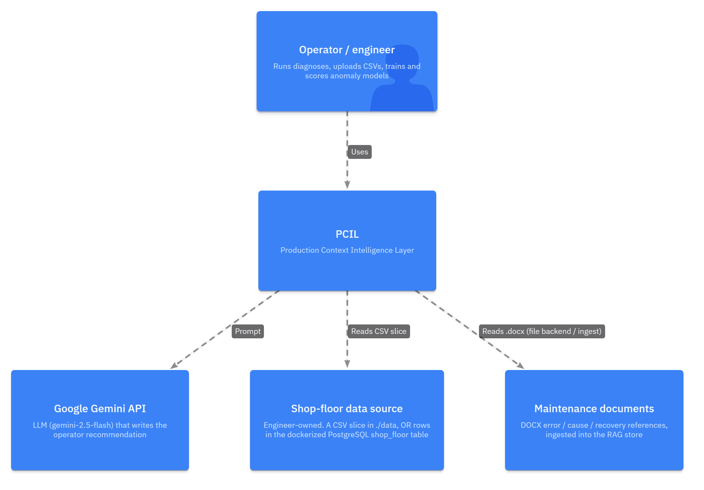
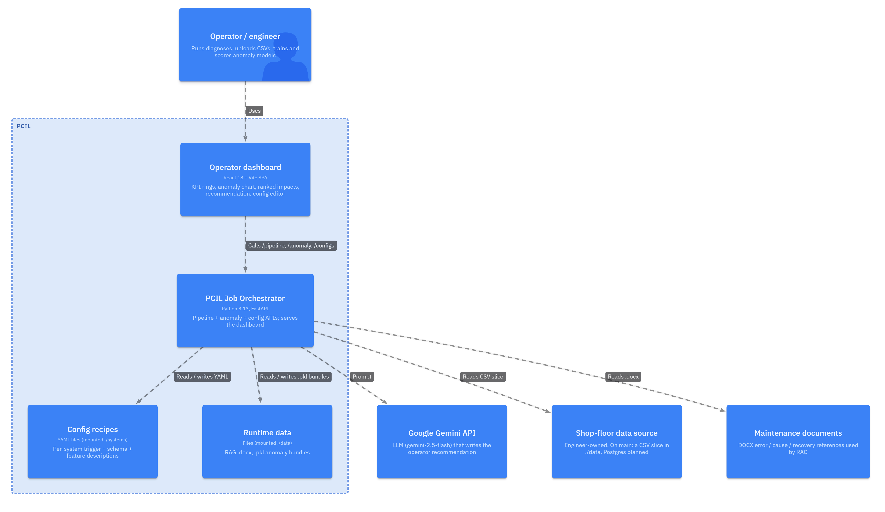
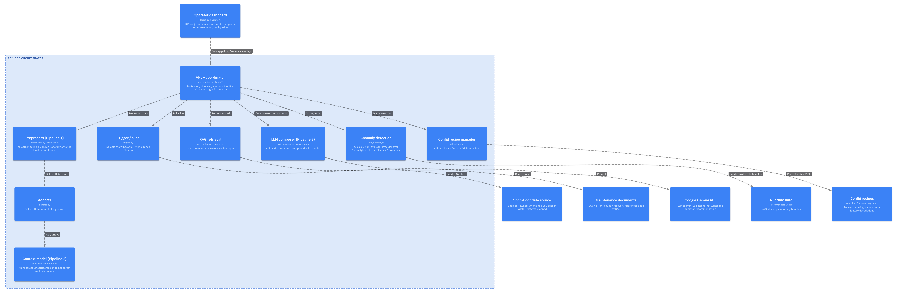
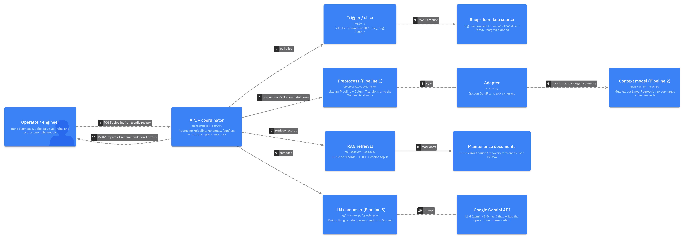
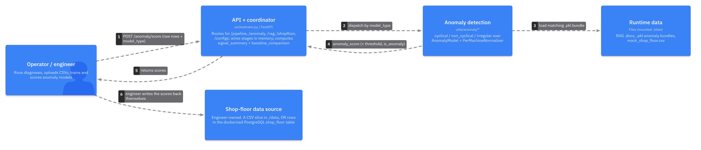

# PCIL — Production Context Intelligence Layer

A pipeline that watches a factory machine, figures out what is slowing
it down, and produces an operator-readable explanation. The first
machine is an inkjet printer at A*STAR SIMTech.

ITP project · Dion Ko (2401112), Zi Hin, Robin, Daniel, Jaymon ·
Supervisor: Winardi.

> **Deploying or testing the solution?** Start with
> [`DEPLOYMENT.md`](DEPLOYMENT.md) — docker-compose setup, how to
> trigger the pipeline, and the full API URL reference. This README is
> the developer-facing documentation.

---

## What it does

```
HTTP request --> Orchestrator (FastAPI) --> Pipeline #1 --> Golden DataFrame
                                            (preprocess)    (clean spreadsheet)
                                                                  |
                                                                  v
                                                          Pipeline #2
                                                          (regression model)
                                                                  |
                                                                  v
                                                          Pipeline #3 (RAG)
                                                                  |
                                                                  v
                                                              JSON response
```

The runtime entry point is a FastAPI service called the **PCIL Job
Orchestrator** (`pcil/orchestrator.py`). It exposes endpoints for:

- Running the full pipeline against a shop-floor slice
  (`/pipeline/run` or `/pipeline/run_csv`).
- Training and scoring per-machine anomaly models
  (`/anomaly/train`, `/anomaly/score`), plus `/anomaly/models` listing
  the trained bundles in `data/` (drives the dashboard's bundle
  indicator).
- Listing, validating, editing, creating and deleting config recipes
  (`/configs`, `/configs/load`, `/configs/validate`, `/configs/save`,
  `/configs/create`, `/configs/delete`) — the dashboard's Config tab is
  built on these; saves are validated server-side and backed up, deletes
  are recoverable (moved to `.backups/`), so the YAML can't be corrupted
  or lost from the UI, and new systems can be onboarded without
  touching the repo.

Anomaly detection is split into three specialist subpackages —
cyclical (periodic signals like pressure), non_cyclical (continuous
uniformly-sampled signals like acoustic vibration), and irregular
(irregularly-sampled data like event logs and on-change sensors). The
engineering team's ingestion calls `/anomaly/score` over HTTP and
writes the returned score into the shop-floor database themselves.

---

## Architecture (C4)

PCIL is documented with the [C4 model](https://c4model.com) - diagrams at increasing
zoom: **Context** (the system and who it talks to), **Container** (the runnable pieces),
and **Component** (the code modules inside a container), plus a **runtime data-flow** that
shows the contract handed between pipeline stages. The *Code* level (L4) is intentionally
skipped - the source is the truth at that zoom. The diagrams below are generated from a
single [LikeC4](https://likec4.dev) model, [`docs/c4/pcil.c4`](docs/c4/pcil.c4) - edit it
and re-export the PNGs with the steps in [`docs/c4/README.md`](docs/c4/README.md). You
can also **browse the interactive version** at
[dionkcq.github.io/ITP_PCIL](https://dionkcq.github.io/ITP_PCIL/) - auto-deployed from
`docs/c4/` via GitHub Pages.

> **Scope.** These reflect the current `main` branch: a CSV/file data source and a
> **single** orchestrator container (pipeline + anomaly together). The planned PostgreSQL
> source and the pipeline/anomaly container split are in the
> [Roadmap](#roadmap-not-yet-on-main) below.

### Level 1 - System context



### Level 2 - Containers



### Level 3 - Components (the orchestrator's internals)

Inside the single FastAPI container, the request coordinator (`orchestrator.py`) wires
together the pipeline stages, the anomaly subpackages, and the config-recipe manager.
Data passes between stages **in memory**; nothing is written to disk during a normal run.



Notes:
- The **dashboard** (a separate container, shown at Level 2 above) is served by this
  process via FastAPI `StaticFiles` at `/dashboard`, but it is not a code component of the
  pipeline.
- The optional Flask `rag_frontend/` demo UI is **not** part of the deployed image and is
  omitted here.

### Runtime data-flow - the stage contracts

The diagnosis path (`POST /pipeline/run`). Each arrow is the contract the previous stage
produces and the next one accepts - "stage 1 produces this, stage 2 consumes it":



`target_summary` (from the context-model stage) is also fed into the composer, so the
recommendation is grounded in measured performance, and it drives the dashboard KPI cards.

#### Anomaly scoring (separate engineer-facing API)

Anomaly detection is **input to output only** - PCIL never writes to the shop-floor data.
The engineer calls the API and writes the returned score back themselves (only they know
the row mapping):



#### Contract table

| Stage | Input | Output contract |
|---|---|---|
| Trigger (`_pull_slice`) | config recipe (trigger mode + source) | shop-floor slice DataFrame (timestamp + declared columns) |
| Preprocess (Pipeline 1) | slice + recipe schema | Golden DataFrame: timestamp, targets (passthrough), features scaled 0-1 |
| Adapter | Golden DataFrame | `X` (rows x features), `y` (rows x targets), names; raises if features leave 0-1 |
| Context model (Pipeline 2) | `X`, `y` | impacts dict (`system`, `context_window`, per-target `ranked_feature_impacts`) + fitted model; orchestrator also computes `target_summary` |
| RAG retrieval | query from target names + top feature descriptions | top-k records (`error`, `cause`, `recovery`, `source_doc`) |
| LLM composer (Pipeline 3) | impacts + records + `target_summary` | `operator_recommendation` + `recommendation_status` (ok / no_records / retrieval_failed / llm_unavailable / rag_unavailable) |
| Response | all of the above | JSON: impacts, target_summary, recovery_records, operator_recommendation, recommendation_status, artifacts |
| `/anomaly/score` | raw time-series rows + `model_type` (+ `model_id`) | `anomaly_score` per cycle/window (+ `threshold`, `is_anomaly`) |
| `/anomaly/train` | uploaded CSV(s) + params | persisted `.pkl` bundle under `data/` |

### Roadmap (not yet on `main`)

These change the diagrams above and are deliberately excluded so the diagrams match what
ships on `main` today. They are being built on a separate branch:

- **PostgreSQL source (P1).** The Context view gains an external **Shop-floor PostgreSQL
  database**; the orchestrator's `_pull_slice` gains a SQL branch (query built from the
  recipe; `psycopg` + SQLAlchemy via a `PCIL_DB_URL` env var). The CSV path stays as a
  fallback.
- **Pipeline / anomaly container split (P2).** The single orchestrator container becomes
  **two** containers - a lightweight **Pipeline service** and an **Anomaly service** (with
  `torch` only in the anomaly image) - so projects that do not need anomaly detection can
  run the pipeline alone.

When that branch merges, add a second Container diagram showing both services + the
database, and keep the single-container diagram above as the baseline for comparison.

---

## Quickstart

```powershell
# 1. Install dependencies
pip install -r requirements.txt

# 2. Set up environment variables (see "Setup — environment" below)
Copy-Item .env.example .env
# edit .env to fill in your real GEMINI_API_KEY

# 3. Start the orchestrator
python -m uvicorn pcil.orchestrator:app --host 0.0.0.0 --port 8000

# 4. Browse the auto-generated API documentation
#    http://localhost:8000/docs           Swagger UI
#    http://localhost:8000/               service metadata
#    http://localhost:8000/dashboard/     operator dashboard (if built)
```

The operator dashboard is served by the same FastAPI process at
`/dashboard/` whenever a built `dashboard/dist/` directory is present.
For local Python-only development the directory is absent, so
`/dashboard/` returns 404 — that is expected and does not affect the
API endpoints. To produce the bundle locally, run `npm run build` in
`dashboard/`. The Docker image builds it automatically (see below), so
NUC operators get the dashboard with no Node toolchain installed.

For a one-shot end-to-end check that every endpoint behaves:

```powershell
python -m pytest tests/ -v
# or for the existing integration smoke test:
python scripts/smoke_test_orchestrator.py
```

---

## Setup — environment

Pipeline #3 (RAG) uses the Google Gemini API to compose the operator
recommendation. The key is read from the `GEMINI_API_KEY` environment
variable at request time (not at startup), so the orchestrator boots
even if the key is missing — calls to `/pipeline/run` will still
return real impacts JSON, with a fallback string in
`operator_recommendation`.

```powershell
Copy-Item .env.example .env
# then edit .env and replace YOUR_GEMINI_API_KEY with a real key from
# https://aistudio.google.com/apikey
```

`.env` is gitignored. The committed template `.env.example` documents
every variable the project reads (plus the docker-compose knobs
`PCIL_IMAGE` / `PCIL_PORT` / `PCIL_DATA_DIR`):

| Variable | Read by | Required? |
|---|---|---|
| `GEMINI_API_KEY` | `pcil.rag.composer` | Yes for live recommendations; fallback string returned otherwise |
| `PCIL_PROJECT_ROOT` | `pcil.orchestrator` | Only when running in Docker (the image sets it to `/app`) |
| `ORCHESTRATOR_URL` | `rag_frontend/app.py` | Only when using the optional Flask demo UI |
| `PCIL_CONFIG_PATH` | `rag_frontend/app.py` | Only when using the optional Flask demo UI |

The orchestrator never logs the key. For Docker, pass `.env` via
`docker run --env-file .env ...` — see the Docker section below.

---

## Factory test API endpoints

These three endpoints are what SIMTech will hit during the 12 June NUC
test. Each `curl` example below assumes the orchestrator is running on
`http://localhost:8000` (substitute the NUC's IP for real testing).

### A. Train a cyclical anomaly model

`POST /anomaly/train` accepts a CSV upload, trains the model, and saves
a bundle at `data/cyclical_<model_id>.pkl`.

```bash
curl -X POST http://localhost:8000/anomaly/train \
     -F "model_type=cyclical" \
     -F "model_id=inkjet_01" \
     -F "training_mode=normal_only" \
     -F "model_name=isolation_forest" \
     -F "machine_id_column=machine_id" \
     -F "signal_column=signal_value" \
     -F "timestamp_column=timestamp" \
     -F "file=@cyclical_dataset.csv"
```

The training CSV must contain at least the columns named by
`machine_id_column`, `signal_column`, and `timestamp_column`. The
defaults match the cyclical-data convention SIMTech uses
(`machine_id` / `signal_value` / `timestamp`), so for most calls only
`file=` needs to change.

For non-cyclical (acoustic) training, supply two recordings — one
clean, one with anomalies:

```bash
curl -X POST http://localhost:8000/anomaly/train \
     -F "model_type=non_cyclical" \
     -F "model_id=inkjet_01" \
     -F "training_mode=clean_vs_anomaly" \
     -F "clean_file=@machine_on_clean.csv" \
     -F "anomaly_file=@machine_on_anomaly.csv"
```

The CSV must have the four channel columns the Random Forest expects
(`Acceleration 0 (g)`, `Acceleration 1 (g)`, `Acceleration 2 (g)`,
`AE (V) (V)`). The default `window_size_rows=12800` is 0.5 s at
25.6 kHz; pass a smaller value (e.g. `-F "window_size_rows=20"`) for
short recordings.

For irregularly-sampled data (event logs, on-change sensors), train the
irregular pipeline on a normal-operation CSV with `machine_id` +
`timestamp` columns (plus an optional numeric value column):

```bash
curl -X POST http://localhost:8000/anomaly/train \
     -F "model_type=irregular" \
     -F "training_mode=normal_only" \
     -F "model_id=inkjet_01" \
     -F "window_seconds=1.0" \
     -F "value_column=signal_value" \
     -F "file=@irregular_dataset.csv"
```

It slices on fixed-DURATION time windows (not row counts, which assume
a uniform sample rate), extracts event-rate + inter-arrival-gap
features, and fits an unsupervised IsolationForest. See
`pcil/utils/anomaly/irregular/README.md` for the design.

### B. Score an anomaly

Once a bundle exists on disk, `POST /anomaly/score` accepts a chunk of
time-series data and returns per-window (or per-cycle) anomaly scores.

```bash
curl -X POST http://localhost:8000/anomaly/score \
     -H "Content-Type: application/json" \
     -d '{
       "model_type": "cyclical",
       "model_id": "inkjet_01",
       "data": [
         {"timestamp": "2026-06-12T09:00:00", "machine_id": "inkjet_01", "signal_value": 0.42},
         {"timestamp": "2026-06-12T09:00:01", "machine_id": "inkjet_01", "signal_value": 0.45}
       ]
     }'
```

Returns:

```json
{
  "status": "ok",
  "model_type": "cyclical",
  "model_id": "inkjet_01",
  "input_rows": 2,
  "cycles_scored": 0,
  "anomaly_scores": [],
  "is_anomaly": [],
  "threshold": 0.62,
  "bundle_path": "/app/data/cyclical_inkjet_01.pkl"
}
```

Cyclical and irregular responses include `is_anomaly` flags computed
against the `threshold` stored in the bundle at train time (95th
percentile of training scores). Non-cyclical scores are already
class probabilities from the supervised Random Forest, so callers
threshold those directly (e.g. at 0.5).

**What SIMTech does with the result:** take the `anomaly_scores`
array, decide which row of the shop-floor DB it maps to (only SIMTech's
ingestion knows that), and `UPDATE` the row with the value. The API
does not write to the shop-floor database — that stays under SIMTech's
control.

### C. Run the full pipeline from an uploaded shop-floor CSV

`POST /pipeline/run_csv` is the engineer-friendly variant of
`/pipeline/run`. Instead of pulling the slice from
`cfg["trigger"]["source"]`, the slice arrives directly as a multipart
upload.

```bash
curl -X POST http://localhost:8000/pipeline/run_csv \
     -F "config_path=systems/inkjet_printer/config.yaml" \
     -F "persist=false" \
     -F "file=@shop_floor.csv"
```

The uploaded CSV must match the schema declared in
`config.yaml`'s `input` block (timestamp column, numerical features,
categorical features, targets). The response shape matches
`/pipeline/run` — same `impacts` dictionary, same `recovery_records`
placeholder, same `operator_recommendation` placeholder.

---

## Project structure

```
PCIL_dev/
├── Dockerfile                       # python:3.13-slim image for NUC deployment
├── docker-compose.yml               # one-command deployment (see DEPLOYMENT.md)
├── DEPLOYMENT.md                    # tester-facing guide: compose + API reference
├── requirements.txt                 # pinned floors for Python deps
├── pcil/                            # the package
│   ├── orchestrator.py              # FastAPI app + endpoints
│   ├── preprocess.py                # Pipeline #1 (shop-floor DF -> Golden DF)
│   ├── adapter.py                   # Golden DF -> (X, y) numpy arrays
│   ├── train_context_model.py       # Pipeline #2 — LinearRegression + impacts JSON
│   ├── trigger.py                   # slice_by_time / slice_last_n_rows helpers
│   ├── rag/                         # Pipeline #3 (Robin)
│   │   ├── loader.py                # DOCX -> RecoveryRecord list
│   │   ├── lookup.py                # TF-IDF + cosine-similarity retrieval
│   │   └── composer.py              # Gemini API call -> operator paragraph
│   └── utils/anomaly/
│       ├── base.py                  # AnomalyModel ABC + PerMachineNormaliser
│       ├── cyclical/                # Jaymon's 1D CNN autoencoder pipeline
│       │   ├── slice.py, features.py, model.py, train.py, score.py
│       │   └── prepare_data.py
│       ├── non_cyclical/            # Zi Hin's RandomForest pipeline
│       │   ├── slice.py, features.py, model.py, score.py
│       │   ├── train.py             # reusable training fn (used by /anomaly/train)
│       │   ├── run.py               # CLI wrapper around train.py
│       │   └── non_cyclical_config.yaml
│       └── irregular/               # event-log / on-change-sensor pipeline
│           ├── slice.py, features.py, model.py, train.py, score.py
│           └── README.md            # design rationale + tuning notes
├── systems/inkjet_printer/         # one folder per system
│   ├── config.yaml                  # recipe — trigger, schema, feature descriptions
│   └── output/                      # generated golden DF / impacts JSON / .pkl
├── scripts/
│   ├── build_mock_shop_floor.py     # generates data/mock_shop_floor.csv
│   └── smoke_test_orchestrator.py   # end-to-end integration check
└── tests/                           # pytest suite
    ├── conftest.py                  # fixtures (TestClient, fixture paths, isolated_data_dir)
    ├── fixtures/                    # committed CSV fixtures (~50 rows each)
    │   ├── _generate.py             #   regenerator if fixtures need to be rebuilt
    │   ├── shop_floor_tiny.csv
    │   ├── cyclical_tiny.csv
    │   ├── non_cyclical_clean_tiny.csv
    │   └── non_cyclical_anomaly_tiny.csv
    ├── test_root.py
    ├── test_pipeline_run.py
    ├── test_pipeline_run_csv.py
    ├── test_anomaly_score.py
    ├── test_anomaly_train.py
    ├── test_anomaly_irregular.py
    ├── test_configs.py
    ├── test_rag_lookup.py
    ├── test_rag_loader.py
    └── test_dashboard.py
```

The raw machine data lives **outside** this repo (it's too big for
GitHub — gitignored at `data/`). See the Setup section below for where
to put it.

---

## CLI usage (still supported)

The CLIs that existed before the orchestrator are still callable. Use
them for one-off training / scoring without spinning up the API:

```powershell
# Train cyclical via CLI (uses Clean_Data.csv pipeline)
python -m pcil.utils.anomaly.cyclical.prepare_data --input ../data/Clean_Data.csv --output-dir ../data/
python -m pcil.utils.anomaly.cyclical.train --input ../data/cyclical_dataset.csv --output ../data/cyclical_inkjet_01.pkl

# Train non-cyclical via CLI (uses non_cyclical_config.yaml paths)
python pcil/utils/anomaly/non_cyclical/run.py

# Train + score irregular via CLI
python -m pcil.utils.anomaly.irregular.train --input ../data/irregular_dataset.csv --output ../data/irregular_inkjet_01.pkl
python -m pcil.utils.anomaly.irregular.score --input ../data/irregular_eval.csv --model ../data/irregular_inkjet_01.pkl --output ../data/irregular_eval_scored.csv

# Run Pipeline #1 via CLI (legacy)
python -m pcil.preprocess --input ../data/mock_shop_floor.csv --config inkjet_printer
python -m pcil.train_context_model
```

The CLIs are kept so the dev workflow doesn't break for teammates who
prefer them; the API is now the canonical runtime path.

---

## Dependencies

Python 3.13+ with everything pinned in `requirements.txt`. To install:

```powershell
pip install -r requirements.txt
```

Highlights:

- `fastapi`, `uvicorn`, `pydantic`, `python-multipart` — orchestrator
- `scikit-learn`, `pandas`, `numpy`, `scipy`, `joblib` — Pipelines + anomaly
- `python-docx`, `google-genai` — RAG retrieval + Gemini composer
- `flask`, `requests` — optional `rag_frontend/` demo UI (not used by the API itself)
- `pytest`, `httpx` — test suite (TestClient uses httpx under the hood)

---

## Running tests

```powershell
python -m pytest tests/ -v
```

All tests are hermetic: they use the committed fixture CSVs in
`tests/fixtures/`, and any bundle the API writes is redirected into a
per-test `tmp_path` via the `isolated_data_dir` fixture, so a test run
never pollutes `ITP/data/`.

To regenerate the fixture CSVs (e.g. if a column schema changes):

```powershell
python tests/fixtures/_generate.py
```

---

## Docker deployment

The supported deployment path is **docker-compose** — one service that
serves both the API and the dashboard on port 8000. The step-by-step
guide for testers (data folder layout, .env, verification, API
reference) is [`DEPLOYMENT.md`](DEPLOYMENT.md); the short version:

```powershell
# from this directory (PCIL_dev/ has PCIL_DATA_DIR=../data in its .env;
# a standalone deploy uses ./data next to docker-compose.yml)
docker compose build      # or: docker compose pull  (prebuilt image)
docker compose up -d
# then visit:
#   http://localhost:8000/dashboard/   operator dashboard (single page UI)
#   http://localhost:8000/docs         Swagger UI
docker compose logs -f    # follow logs
docker compose down       # stop
```

Plain `docker` still works if compose is unavailable:

```powershell
docker build -t pcil:latest .
docker run --rm -p 8000:8000 `
    -e GEMINI_API_KEY=$env:GEMINI_API_KEY `
    -v "$(pwd)/../data:/app/data" `
    pcil:latest
```

The Dockerfile is a two-stage build: a `node:20-slim` stage runs
`npm ci && npm run build` against `dashboard/`, then the runtime
`python:3.13-slim` stage copies the resulting `dist/` into
`/app/dashboard/dist`. `DASHBOARD_DIST_DIR` defaults to that path so
the orchestrator mounts the static files automatically — Winardi (or
any operator on the NUC's LAN) just opens
`http://<nuc-ip>:8000/dashboard/` in a browser. No Node, npm, or Vite
process is required at runtime.

The container expects two things at runtime:

- **`/app/data` mounted from the host's `data/` folder** — anomaly
  bundles (`<model_type>_<model_id>.pkl`), the mock shop-floor CSV, and
  the RAG document directory `data/RAG/*.docx`. Compose mounts
  `PCIL_DATA_DIR` (default `./data`) there.
- **`GEMINI_API_KEY` in the environment** so the LLM composer can call
  Gemini. Compose forwards it from the `.env` file next to
  `docker-compose.yml` — and deliberately forwards ONLY that variable,
  because a stray `PCIL_PROJECT_ROOT` from a dev `.env` would override
  the image's `/app` and break every data path. Without the key the
  orchestrator still boots and `/pipeline/run` still returns impacts
  JSON, but `operator_recommendation` will be a fallback string.

### Publishing the image (maintainer)

Winardi's test environment pulls `ghcr.io/dionkcq/itp_pcil:latest`
(the default `image:` in `docker-compose.yml`). To publish a new
build from this directory:

```powershell
docker build -t ghcr.io/dionkcq/itp_pcil:latest .
docker login ghcr.io -u Dionkcq      # password = GitHub PAT with write:packages
docker push ghcr.io/dionkcq/itp_pcil:latest
# first push only: github.com -> profile -> Packages -> itp_pcil ->
# Package settings -> Change visibility -> Public (so the test
# environment can pull without credentials)
```

For an offline test environment, ship a tarball instead:

```powershell
docker save -o pcil_image.tar ghcr.io/dionkcq/itp_pcil:latest
# on the target machine: docker load -i pcil_image.tar
```

---

## Status

| Component | Status |
|---|---|
| Pipeline #1 (preprocess) | working — sklearn `ColumnTransformer` (MinMaxScaler + OneHotEncoder) |
| Pipeline #2 (context model) | working — multi-target `LinearRegression` + new Week-3 impacts JSON schema |
| Pipeline #3 (RAG) | working — DOCX loader, TF-IDF lookup, Gemini composer wired into `/pipeline/run` |
| Orchestrator | working — 5 endpoints, Docker image, 45 pytest tests pass |
| Anomaly: cyclical | working — Jaymon's 1D CNN autoencoder (peak slicing + waveform features) |
| Anomaly: non_cyclical | working — Zi Hin's RandomForest (~0.68 recall on labelled acoustic dataset) |
| Anomaly: irregular | working — time-window + arrival-pattern IsolationForest (pipeline definition; demoed on synthetic event data, no real irregular dataset yet) |
| LLM composer | working — Gemini (`gemini-2.5-flash` via `google-genai`, 30 s timeout), records survive composer failures |
| `rag_frontend/` (optional Flask demo UI) | working — proxy-only client, not in the Docker image |
| Operator dashboard | working — React + Vite client, served by the orchestrator at `/dashboard/` and bundled into the Docker image via multi-stage build |
| Config recipe editor | working — dashboard Config tab + `/configs*` endpoints; form-based editing, server-side validation, timestamped backups, save-as-new-recipe |
